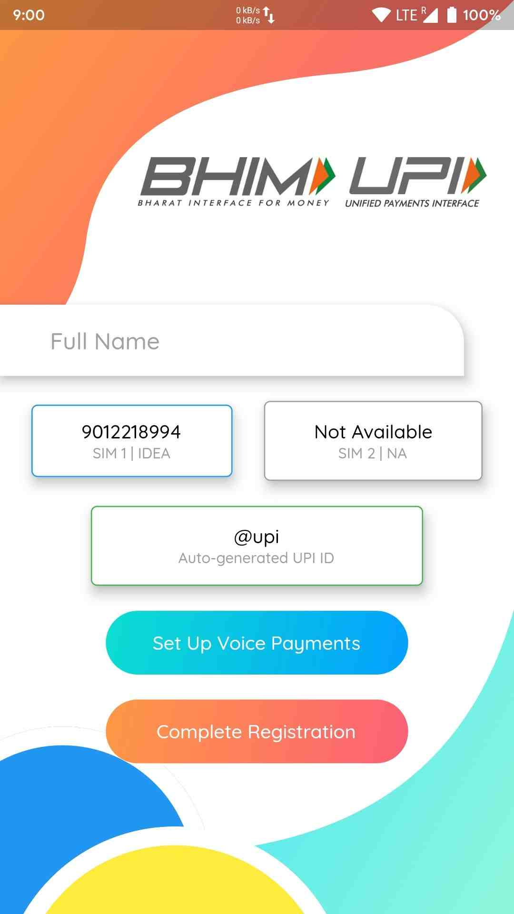
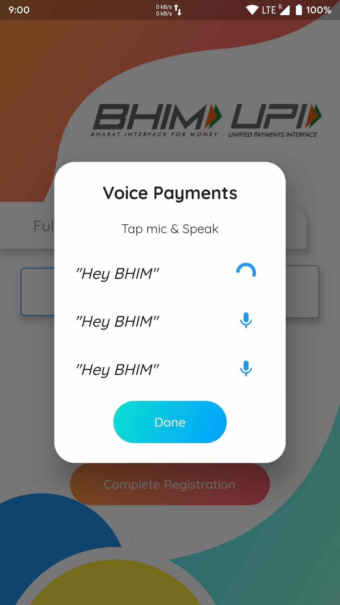
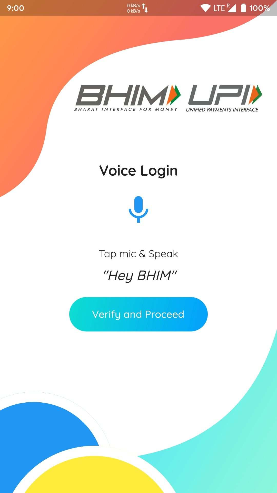

<p align="center">
  <a href="https://github.com/ShivamGoyal1899/BHIM">
    
  </a>
</p>
<p align="center">
  Bharat Interface for Money (BHIM) is a payment app that lets you make simple, easy and quick transactions using Unified Payments Interface (UPI). I've built a Voice Module that is lightweight in size and can be integrated into the existing BHIM App.
</p>
<p align="center">
  <a href="https://github.com/ShivamGoyal1899/BHIM/blob/master/LICENSE">
    
  </a>
  <a href="https://github.com/ShivamGoyal1899/BHIM/releases">
    
  </a>
  <a href="https://github.com/ShivamGoyal1899/BHIM/archive/master.zip">
    
  </a>
  <a href="https://github.com/ShivamGoyal1899/BHIM/releases">
    
  </a>
  <a href="https://paypal.me/shivamgoyal1899">
    
  </a>
</p>
<p align="center">
Show some love 💜 and Star ⭐️ the Repository to support the project.
</p>

|                 Registration Screen               |                 Voice Registration                |                    Voice Login                    |
|:-------------------------------------------------:|:-------------------------------------------------:|:-------------------------------------------------:|
|  |  |  |

## What’s In This Document

- [Get Up and Running in 5 Minutes](#rocket-get-up-and-running-in-5-minutes)
- [Flutter / Dart Packages Used](#ballot_box-flutter--dart-packages-used)
- [Versioning](#label-versioning)
- [Queries / Bugs](#question-queries--bugs)
- [License](#memo-license)
- [Thanks to Contributors and Sponsors](#purple_heart-thanks)

## :rocket: Get Up and Running in 5 Minutes

You can get the BHIM App up and running on your local dev environment in 5 minutes with these four steps:

1. **Install the Flutter SDK & Android Studio. [Instructions](https://medium.com/enappd/install-flutter-on-windows-and-mac-1fd1dde453ba).**

2. **Open Terminal & navigate to the root directory of the project.**

    ```shell
    cd BHIM
    ```

3. **Run and launch the build on preferred device.**

   ```shell
   flutter run
   ```

4. **Open the source code and start editing!**

   Your app is now running on your physical device or emulator. Open the `lib` directory in Android Studio itself and edit `*.dart` files. Hot Reload your changes, and the app will update in real time!

At this point, you’ve got the fully functional BHIM App running. For additional information on how you can customize your Flutter Apps, see [Google Codelabs](https://codelabs.developers.google.com/codelabs/flutter/) and [HackerNoon Guide](https://hackernoon.com/making-the-most-of-flutter-from-basics-to-customization-433171581d01).

## :ballot_box: Flutter / Dart Packages Used
|    Package Name    	| Package Version 	|                           Package URL                          	|
|:------------------:	|:---------------:	|:--------------------------------------------------------------:	|
| url_launcher       	|      latest     	| [Open on pub.dev](https://pub.dev/packages/url_launcher)    	    |
| font_awesome_flutter	|      latest     	| [Open on pub.dev](https://pub.dev/packages/font_awesome_flutter)  |
| barcode_scan    	    |      latest     	| [Open on pub.dev](https://pub.dev/packages/barcode_scan)          |
| qr_flutter 	        |      latest     	| [Open on pub.dev](https://pub.dev/packages/qr_flutter)            |
| path_provider     	|      latest     	| [Open on pub.dev](https://pub.dev/packages/path_provider)         |
| screenshot_and_share 	|      latest     	| [Open on pub.dev](https://pub.dev/packages/screenshot_and_share)  |
| speech_recognition 	|      latest     	| [Open on pub.dev](https://pub.dev/packages/speech_recognition) 	|
| scratcher          	|      latest     	| [Open on pub.dev](https://pub.dev/packages/scratcher)             |
| http               	|      latest     	| [Open on pub.dev](https://pub.dev/packages/http)              	|
| permission_handler  	|      latest     	| [Open on pub.dev](https://pub.dev/packages/permission_handler)    |
| native_contact_picker	|      latest     	| [Open on pub.dev](https://pub.dev/packages/native_contact_picker) |
| simple_rsa        	|      latest     	| [Open on pub.dev](https://pub.dev/packages/simple_rsa)            |
| random_string     	|      latest     	| [Open on pub.dev](https://pub.dev/packages/random_string)         |
| shared_preferences  	|      latest     	| [Open on pub.dev](https://pub.dev/packages/shared_preferences)    |
| recase     	        |      latest     	| [Open on pub.dev](https://pub.dev/packages/recase)                |
| file              	|      latest     	| [Open on pub.dev](https://pub.dev/packages/file)                  |
| file_picker          	|      latest     	| [Open on pub.dev](https://pub.dev/packages/file_picker)           |
| typed_data          	|      latest     	| [Open on pub.dev](https://pub.dev/packages/typed_data)            |
| audio_recorder     	|      latest     	| [Open on pub.dev](https://pub.dev/packages/audio_recorder)     	|

## :label: Versioning
I've used [Semantic Versioning 2.0.0](https://semver.org/) for versioning throughout the project.

## :question: Queries / Bugs
If you got any queries or found a bug, open an [Issue](https://github.com/ShivamGoyal1899/BHIM/issues/new) or ping me over on [hi@itsshivam.com](mailto:hi@itsshivam.com)

## :memo: License
Licensed under the [MIT License](./LICENSE).

## :purple_heart: Thanks

Thanks to all contributors and to sponsors for supporting the project.